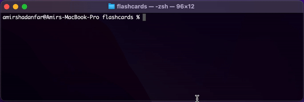

# Flashcard

This application is an interactive CLI program for Flashcard practice. 
For context: a flashcard is a spaced repetition tool for memorising questions and their respective answers.




### Services
- PHP 8.1
- Mysql 8

### Requirements
- Docker
- Docker Compose

### Installation
```
$ git clone https://github.com/amir-shadanfar/flashcards.git

$ cd flashcard

$ cp .env.example .env

$ docker run --rm \
    -u "$(id -u):$(id -g)" \
    -v $(pwd):/var/www/html \
    -w /var/www/html \
    laravelsail/php81-composer:latest \
    composer install --ignore-platform-reqs

$ ./vendor/bin/sail up

$ ./vendor/bin/sail artisan migrate

$ ./vendor/bin/sail artisan db:seed
```

### Usage
```
$ ./vendor/bin/sail artisan flashcard:interactive
```

### Tests
```
$ ./vendor/bin/sail artisan test
```

